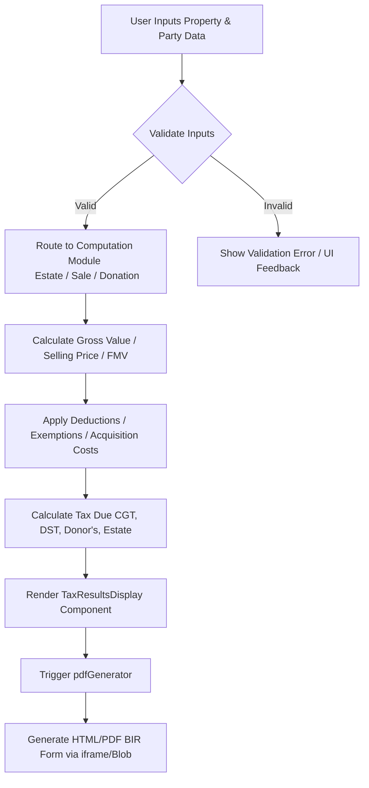

# Base44 Tax Calculator

A comprehensive, professional Philippine tax calculator web application designed for processing Estate, Sale, and Donation taxes. It features real-time computations, interactive financial solvers, and automated generation of BIR forms.

## Setup Instructions

### Prerequisites
- Node.js (v18+)
- npm or yarn

### Project Dependencies
- **React 18** (UI Framework)
- **Vite** (Build Tool)
- **Tailwind CSS** (Styling)
- **Framer Motion** (Animations)
- **Lucide React** (Icons)
- **Shadcn/UI** (Component Library)

### Steps on How to Run the Application

1. **Install dependencies:**
   ```bash
   npm install
   ```
2. **Run local development server:**
   ```bash
   npm run dev
   ```
3. **Build for production:**
   ```bash
   npm run build
   ```
   The output will be in the `dist/` folder.

### Vercel Deployment
1. Push this project to a repository (GitHub/GitLab/Bitbucket).
2. Link it to a Vercel project. Vercel will automatically detect the Vite configuration.
3. The `vercel.json` file is included to handle Single Page Application (SPA) routing transitions.

---

## System Features & Modules

- **Estate Tax Module:** Computes Philippine Estate Tax based on gross estate (Real properties, Stocks, Vehicles, Securities) minus standard deductions.
- **Sale & Donation Module:** Computes Capital Gains Tax (CGT), Donor's Tax, and Documentary Stamp Tax (DST) for transfers of Real Property, Stocks, Vehicles, and Securities.
- **Financial Solvers:** Built-in interactive calculators for Securities (Gordon Growth Model, Bond Valuation, Time Value of Money PV, and Yield/Returns).
- **Automated BIR Form Generation:** Generates and exports HTML/PDF formats of BIR Form 1801 (Estate), 1800 (Donation), and 1706 (Sale) using computed data via Blob and iframe injection fallbacks.

---

## Project Structure

All project files should be organized clearly. Keep your source code inside a `src` folder, organized into the following subfolders:

- `src/models/` - Data models and schema definitions.
- `src/controllers/` - Business logic and application flow controls.
- `src/views/` - UI templates, frontend components, and pages.
- `src/components/` - React functional components (e.g., `calculator/`, `ui/`).
- `src/lib/` - Computation logic (`taxComputations.js`) and utilities (`pdfGenerator.js`).
- `src/utils/` - Helper functions and shared utilities.
- `src/services/` - External APIs, integrations, and database connection logic.
- `tests/` - Unit and integration tests.
- `docs/` - Project documentation and reference materials.
- `config/` - Configuration files (environment setups, constants).
- `assets/` - Images, fonts, and other static media.

This structure keeps the project organized, makes it easy to find files, and helps the team work efficiently.

---

## API / Core Logic Documentation

### `computeEstateTax(data)`
Calculates the final estate tax given the property details and deductions.
**Input Example:**
```json
{
  "grossEstate": 10000000,
  "standardDeduction": 5000000,
  "medicalExpenses": 0
}
```
**Output Example:**
```json
{
  "netTaxableEstate": 5000000,
  "taxDue": 300000,
  "breakdown": [
    { "label": "Gross Estate", "value": 10000000 },
    { "label": "Standard Deduction", "value": 5000000 }
  ]
}
```

### `computeSaleSecurities(data)`
Calculates the CGT and DST for the sale of securities (equity, debt, derivatives).
**Input Example:**
```json
{
  "securityQuantity": 100,
  "securityUnitValue": 50,
  "securityAccruedInterest": 100,
  "acquisitionCost": 4000,
  "securityType": "equity"
}
```
**Output Example:**
```json
{
  "totalSellingPrice": 5100,
  "totalAcquisitionCost": 4000,
  "netGain": 1100,
  "cgt": 165,
  "dst": 38.25,
  "totalTax": 203.25
}
```

---

## Flow Diagrams

Here is the workflow for the core computation engine.



---

## Error Handling & Possible Issues

Every potential failure must be handled. Do not leave unhandled exceptions. Always handle exceptions, validate inputs, check resources before use, and log errors clearly so the system is easier to debug and maintain.

| Issue | Solution |
| :--- | :--- |
| **Null Values** | Use optional chaining (`?.`), nullish coalescing (`??`), and default parameter values (e.g., `value || 0`). |
| **Database Connection Failures** | Implement robust retry mechanisms with exponential backoff. Provide fallback UI states to the user. |
| **Invalid User Inputs** | Use strict validation schemas before passing data to controllers. Display clear, field-level error messages (e.g., preventing negative quantities). |
| **Missing Files** | Add fallback renders/images. Ensure file existence checks before attempting to read/process files. |
| **API / File Export Errors** | Wrap all external calls and DOM manipulations in `try/catch` blocks. Monitor HTTP status codes and provide friendly error toasts to the user. E.g., `try/catch` around PDF/HTML blob generation. |

### Structured Logging
Always log errors using structured logging. Use the following severity levels:
- `INFO`: Standard lifecycle events and successful operations.
- `WARN`: Recoverable issues, depreciations, or unexpected but handled states.
- `ERROR`: Fatal errors, exceptions, and system failures.

---

## Coder's Notes

Every file **must** start with a standard comment block:

```javascript
//
// File: [filename]
// Author: [Name]
// Date: [YYYY-MM-DD]
// Purpose: [Brief description of what this file does]
//
```

*Note: Add inline comments for any tricky, complex, or heavily mathematical logic inside the file, especially in financial formulas (e.g., Gordon Growth Model, PV).*

---

## Best Practices

These are instructions every developer must follow when creating, maintaining, and testing our app. Follow them strictly to ensure quality, readability, and maintainability:

- **Avoid repeating code (DRY principle).** Centralize shared logic, such as tax computations in `taxComputations.js`.
- **Keep code readable over clever.** Prioritize clarity, explicit variable naming, and readability.
- **Remove unused code immediately.** Keep the codebase lean (e.g., remove unused imports flagged by linters).
- **Peer review all code before merging.** No direct commits to `main` without review.
- **Check for performance bottlenecks.** Profile expensive computations and fix performance gaps early.
